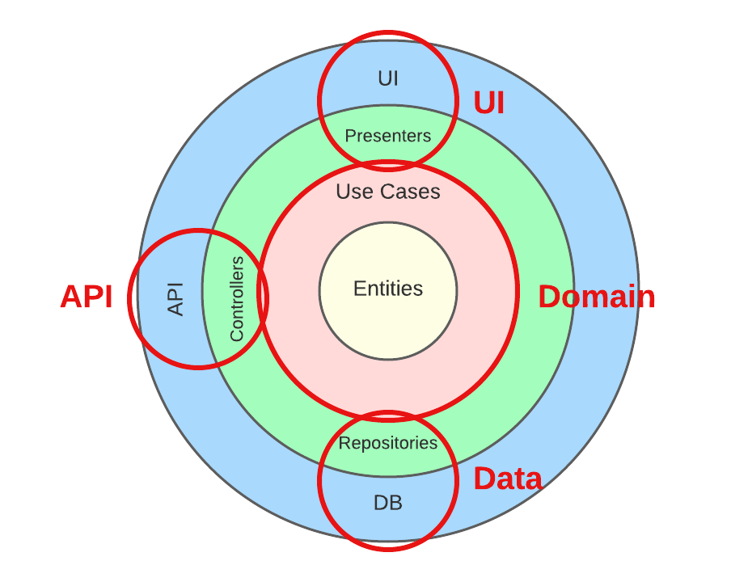
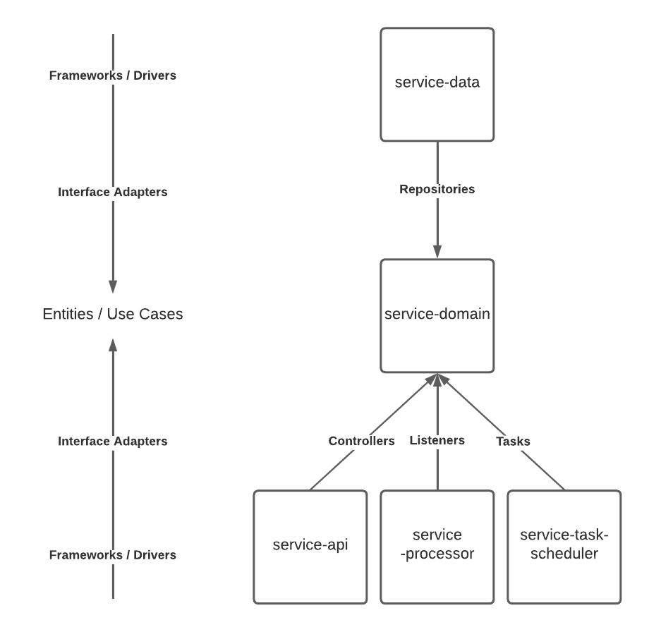

# smart-home.services
The microservices that serve as the smart-home backend.

## Architecture

smart-home services implement [Clean Architecture](https://blog.cleancoder.com/uncle-bob/2012/08/13/the-clean-architecture.html). Each "service" is composed of the following components:

